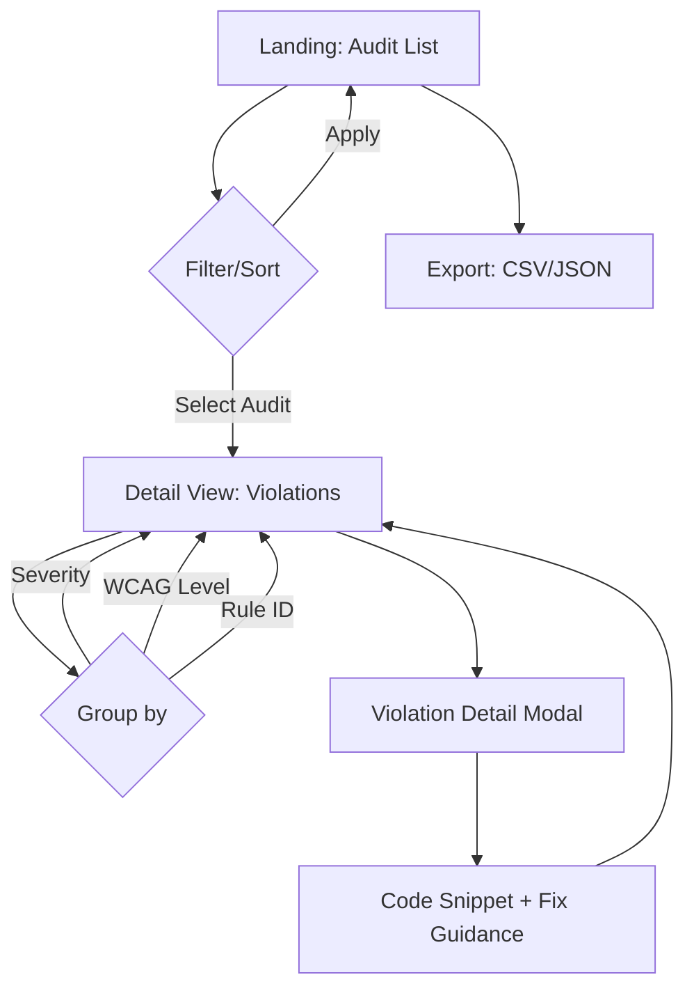

# Accessibility Audit Dashboard — Design Spec

## 1. User Flows



**Mobile-first flow**: Stack → Card list → Tap → Modal detail → Swipe between violations

## 2. Component Breakdown

| Component | Responsibility | Props |
|-----------|---------------|-------|
| `AuditList` | Table/cards of audits | `audits[]`, `filters`, `onFilterChange`, `onSelect` |
| `AuditCard` | Single audit summary row | `audit`, `onClick` |
| `FilterBar` | Multi-filter controls | `filters`, `onChange` |
| `ViolationList` | Grouped violations | `violations[]`, `groupBy`, `onSelect` |
| `ViolationCard` | Single violation | `violation`, `expanded`, `onToggle` |
| `CodeSnippet` | Highlighted source + fix | `html`, `selector`, `suggestion` |
| `SeverityBadge` | A/AA/AAA + critical/major/minor | `level`, `severity` |
| `ExportButton` | Download report | `auditId`, `format` |

## 3. Design Tokens

### Colors (WCAG AA compliant ratios)

```css
:root {
  /* Primitive */
  --color-bg: #ffffff;
  --color-bg-alt: #f8fafc;
  --color-text: #1e293b;
  --color-text-muted: #64748b;
  --color-border: #e2e8f0;
  --color-focus: #2563eb;
  --color-focus-ring: rgba(37, 99, 235, 0.4);

  /* Semantic — Severity */
  --color-critical: #dc2626;    /* 7:1 on white */
  --color-major: #ea580c;       /* 5.5:1 on white */
  --color-minor: #ca8a04;       /* 4.5:1 on white */
  --color-pass: #16a34a;        /* 5.5:1 on white */

  /* Semantic — WCAG Level */
  --color-level-a: #2563eb;
  --color-level-aa: #7c3aed;
  --color-level-aaa: #db2777;

  /* Surface */
  --color-card: #ffffff;
  --color-card-hover: #f1f5f9;
  --color-modal-bg: rgba(15, 23, 42, 0.6);
}
```

### Spacing Scale (4px base)

| Token | Value | Use |
|-------|-------|-----|
| `--space-1` | 4px | Inline gaps |
| `--space-2` | 8px | Component padding |
| `--space-3` | 12px | Card internal |
| `--space-4` | 16px | Section gaps |
| `--space-5` | 24px | Page sections |
| `--space-6` | 32px | Major sections |

### Typography

```css
:root {
  --font-sans: system-ui, -apple-system, sans-serif;
  --font-mono: ui-monospace, SFMono-Regular, monospace;

  --text-xs: 0.75rem;   /* 12px */
  --text-sm: 0.875rem;  /* 14px */
  --text-base: 1rem;    /* 16px */
  --text-lg: 1.125rem;  /* 18px */
  --text-xl: 1.25rem;   /* 20px */
  --text-2xl: 1.5rem;   /* 24px */

  --leading-tight: 1.25;
  --leading-normal: 1.5;
  --leading-relaxed: 1.75;
}
```

### Breakpoints (mobile-first)

| Name | Min-width |
|------|-----------|
| `sm` | 640px |
| `md` | 768px |
| `lg` | 1024px |
| `xl` | 1280px |

## 4. Accessibility Checklist per Component

### AuditList / AuditCard
- [ ] Semantic `<table>` with `<thead>`, `<tbody>` or `<ul role="list">` + `<li role="listitem">`
- [ ] Column headers: `<th scope="col">` with sortable `aria-sort`
- [ ] Row click: `<button>` wrapping card, `aria-pressed` for selection
- [ ] Focus visible: 3px outline, `--color-focus-ring`
- [ ] Empty state: `aria-live="polite"` message

### FilterBar
- [ ] `<form role="search">` wrapper
- [ ] Each filter: `<label>` + native `<select>` or `<input type="date">`
- [ ] `aria-controls` pointing to audit list region
- [ ] `aria-live="polite"` on result count
- [ ] Clear filters button: `aria-label="Limpar filtros"`

### ViolationList / ViolationCard
- [ ] Accordion pattern: `<h3><button aria-expanded>` + `<div role="region" aria-labelledby>`
- [ ] Group heading: `aria-level="3"`
- [ ] Severity badge: `<span role="img" aria-label="Severidade: crítica">`
- [ ] Code snippet: `<pre><code>` with `aria-label="Trecho de código problemático"`

### CodeSnippet
- [ ] Line numbers: `<span aria-hidden="true">` (decorative)
- [ ] Highlighted line: `mark` + `aria-label="Linha com violação"`
- [ ] Copy button: `aria-label="Copiar código"`
- [ ] High contrast mode: forced colors compatible

### Global
- [ ] Skip link: `<a href="#main" class="skip-link">Pular para conteúdo principal</a>`
- [ ] Landmarks: `<header>`, `<nav>`, `<main>`, `<aside>`, `<footer>`
- [ ] Heading hierarchy: h1 → h2 → h3 (no skips)
- [ ] Color not sole info carrier (icons + text)
- [ ] 200% zoom: no horizontal scroll, no content loss
- [ ] Reduced motion: `@media (prefers-reduced-motion)` disables transitions
- [ ] High contrast: Windows HC mode tested
- [ ] Keyboard: Tab order logical, Esc closes modals, Arrow keys in accordions

## 5. Data Model

```typescript
// Report file: reports/{timestamp}-{url-hash}.json
interface AuditReport {
  meta: {
    url: string;
    timestamp: string;        // ISO 8601
    tool: "axe-core" | "pa11y" | "lighthouse";
    version: string;
    durationMs: number;
  };
  summary: {
    total: number;
    bySeverity: Record<"critical" | "major" | "minor", number>;
    byLevel: Record<"A" | "AA" | "AAA", number>;
    byRule: Record<string, number>;
  };
  violations: Violation[];
}

interface Violation {
  id: string;                 // rule ID + selector hash
  ruleId: string;             // e.g. "color-contrast", "label"
  ruleDescription: string;
  wcagLevel: "A" | "AA" | "AAA";
  wcagCriteria: string[];     // e.g. ["1.4.3", "1.4.6"]
  severity: "critical" | "major" | "minor";
  impact: "critical" | "serious" | "moderate" | "minor";
  nodes: ViolationNode[];
  help: string;               // fix guidance
  helpUrl: string;
}

interface ViolationNode {
  html: string;               // outerHTML snippet (max 500 chars)
  target: string[];           // CSS selector path
  selector: string;           // best unique selector
  xpath?: string;
  failureSummary: string;
}
```

### Consumption Notes
- Reports loaded via `fetch("/reports/manifest.json")` → array of `{ filename, meta.summary }`
- Lazy-load full report on detail view: `fetch(`/reports/${filename}`)`
- Client-side filter/sort/group on `violations[]`
- Virtualized list for 1000+ violations

## 6. Responsive Behavior

| Breakpoint | AuditList | ViolationList |
|------------|-----------|---------------|
| `< 640px` | Cards (stacked) | Accordion cards |
| `≥ 640px` | Table | Table + side panel |
| `≥ 1024px` | Table + sticky filters | Split view (list + detail) |

## 7. States

| State | AuditList | ViolationList |
|-------|-----------|---------------|
| Loading | Skeleton rows | Skeleton accordions |
| Empty | "Nenhuma auditoria encontrada" | "Nenhuma violação" |
| Error | Toast + retry button | Inline alert |
| No filters match | `aria-live` count = 0 | Same |

---

**Next**: Implement `AuditList` + `FilterBar` with test data. Wire manifest loader.